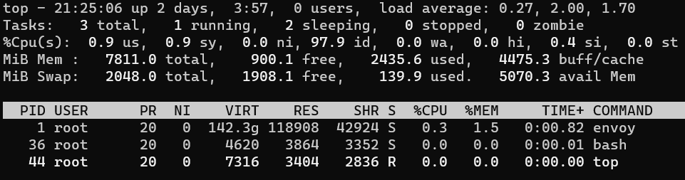
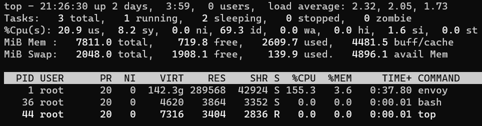
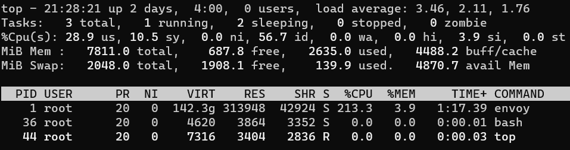
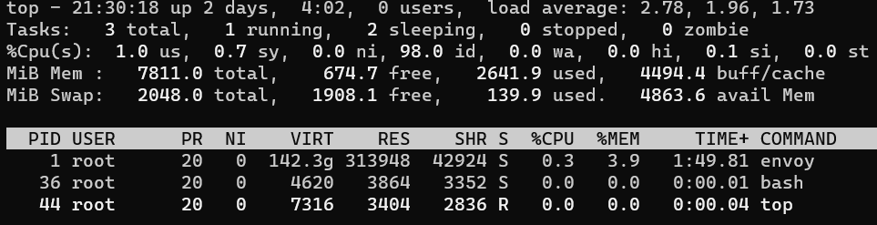

# proxywasm-memory-test
The memory problem in Proxywasm + Tinygo + Envoy

# Dependencies
- Go v1.21.4
- tinygo v0.30.0
- nottinygc v0.7.0
- proxy-wasm-go-sdk v0.22.0
- Envoy v1.28
- 
# Setup
The project contains a simple envoy-sidecar wasm that create an array or bytes of size 10485760 for each request.
To build the wasm file and run envoy use the following commands:
```shell
tinygo build -o plugin.wasm -scheduler=none -target=wasi -no-debug -gc=custom -tags="custommalloc nottinygc_envoy" .
```
```shell
docker-compose up --build
```

# Tests
Here is a script that sends 120 requests with 10 threads within 12 seconds, then wait for 20 seconds, and repeat this iteration 5 times.

Test script requires [hey](https://github.com/rakyll/hey) but can be done with wrk or other tools.

```shell
set HEY_PATH={HEY_PATH}\hey.exe
.\run.cmd
```
or
```shell
./run.sh
```

# Results
When running tests for 5 iterations and looking to the memory usage inside docker (with tools like top or docker-desktop resource usage), 
after each iteration, we found that the memory increased, but after finishing the test, it be never released.

The results show that the RES memory is increasing and never decreased even after sending requests stopped.
Also, it shows that in some cases, when a new iteration starts, the memory gets increased.

```json
{
 "allocated": "15867936",
 "heap_size": "31457280",
 "pageheap_unmapped": "0",
 "pageheap_free": "4661248",
 "total_thread_cache": "10068560",
 "total_physical_bytes": "35057510"
}
```


---
```json
{
 "allocated": "16991256",
 "heap_size": "31457280",
 "pageheap_unmapped": "0",
 "pageheap_free": "3252224",
 "total_thread_cache": "10214792",
 "total_physical_bytes": "35069846"
}
```


---

```json
{
 "allocated": "17154592",
 "heap_size": "31457280",
 "pageheap_unmapped": "0",
 "pageheap_free": "2940928",
 "total_thread_cache": "10404576",
 "total_physical_bytes": "35071334"
}
```


---

```json
{
 "allocated": "17154904",
 "heap_size": "31457280",
 "pageheap_unmapped": "0",
 "pageheap_free": "2891776",
 "total_thread_cache": "10429320",
 "total_physical_bytes": "35071622"
}
```

